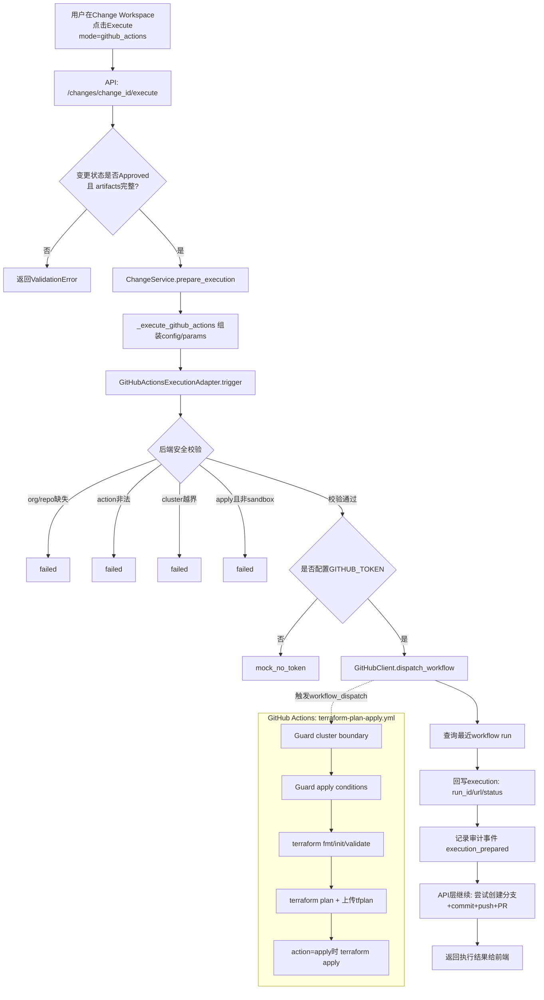

## Jun.08
Bug Fix:
1.Register Porject (https://github.com/Mayra-Zhao_3stripes/blueprint-demo)时报错: 
“Scan Errors
clone: git git clone --depth 1 https://github.com/Mayra-Zhao_3stripes/blueprint-demo.git blueprint-demo failed (exit 128): Cloning into 'blueprint-demo'... fatal: could not read Username for 'https://github.com': terminal prompts disabled
← Back
”
2.Resource Topology中的Project Tree: 其实是Env. 并且Resource Inventory不可以根据类型筛选另外, 如何链接到变更窗口. 
4.Infrastructure Resources中的Inventory,bu h 要根据K8S, AWS等大类进行区分. 
5. Module Management中包含重复类型.

Bug Fix2:
1.Register Porject (https://github.com/Mayra-Zhao_3stripes/blueprint-demo)时仍然报错: clone: git git clone --depth 1 https://github.com/Mayra-Zhao_3stripes/blueprint-demo.git blueprint-demo failed (exit 128): Cloning into 'blueprint-demo'... fatal: could not read Username for 'https://github.com': terminal prompts disabled
2.Resource Topology中只需包含AWS_*及K8S相关, terraform_output, 354 resources目前都不用包含进来.
3.Infrastrue Resource中的内容和Resource Topology有些重复,需要重新align下.
4.从Resource Topology中点Change之后,链接到Infrastrue Resource, 这部分我不太理解
5.修改配置文件后,点击Draft, 出现如下报错: 
{
  "detail": "unsupported Terraform object_id: ODP/resources/dev/ecp/control-tower"
}

## Jun.08-2
1.Resource Types 怎么拆的太细 可以做个分列,点进去才有详细信息
2.按照这个页面逻辑, Infrastructure Resources应该改为 Change Workspace. 我觉得Terraform Control Plant下的导航栏内容再思考下
3.后续我们对所有类型做一个规范, 虽然import terraform. 但是支持的Resouce等是逐步支持的, 提供一个目前支持的list
4.导航栏的序号去掉,并且调整下字体
5.Resource Discovery改为Discovery
6.Resource Management中的布局调整下: 移除Change History, 流程

Bug Fix:
修改ODP/resources/dev/ecp/o2-inventory时报错
{
  "detail": "service not found in infra/ODP/resources/dev/ecp.yaml: o2-inventory"
}

修改ODP/resources/dev/ana/keycloakx时报错
{
  "detail": "source YAML not found: infra/ODP/resources/dev/ana.yaml"
}
## Jun.09
K8S环境: 部署在本地的kind集群, 集群名称: kind-gitops-sandbox
GitProvider: Github Action 
1.学习Github Action, 通过Github Action实现CIC
2.D尝试接入真正的CICD工作流, 真正执行命令通过terraform plan & terraform apply实现K8S资源的变更
3.尝试通过平台将一个服务部署到K8S集群(kind-gitops-sandbox)

安全边界: 仅kind-gitops-sandbox集群可变更,不要操作任何这个集群以外的资源

Runbook: 见 `RUNBOOK_GITHUB_ACTIONS_KIND.md`

### Github Action CI/CD处理逻辑梳理

#### 1) 入口与前置条件
1. 变更执行入口: `POST /changes/{change_id}/execute` 且 `mode=github_actions`
2. 仅当变更状态为 `Approved` 时允许进入执行准备
3. 必须已生成并保留 artifacts: `validation`、`plan`、`approval`、`patched_yaml`

#### 2) 执行链路（后端）
1. API层读取项目配置并补全scope
  - org/repo（来自项目git_config）
  - workflow_id（默认 `terraform-plan-apply.yml`）
  - terraform_root（默认 `infra`）
  - cluster_name（默认 `kind-gitops-sandbox`）
2. ChangeService进入 `prepare_execution(..., mode=github_actions)`
3. `prepare_execution` 调用 `_execute_github_actions`
4. `_execute_github_actions` 组装 dispatch 参数
  - branch: `cr-{change_id}`
  - environment: 变更env（默认sandbox）
  - action: `apply`
  - change_id
  - cluster_name
5. `GitHubActionsExecutionAdapter.trigger()` 执行安全校验
  - 必须提供 org/repo
  - action 仅允许 `plan|apply`
  - cluster_name 必须等于 `kind-gitops-sandbox`
  - 若 action=apply，则 environment 必须是 sandbox
6. 通过 `GitHubClient.dispatch_workflow()` 触发 `workflow_dispatch`
7. 查询最近 workflow run 并回填 run_id / html_url
8. 回写 change.artifacts.execution 与审计事件

#### 3) Workflow内实际Terraform执行
GitHub Actions工作流 `terraform-plan-apply.yml` 中固定执行:
1. Guard cluster boundary（仅允许 `kind-gitops-sandbox`）
2. Guard apply conditions（apply仅允许sandbox + 指定cluster）
3. terraform fmt -check
4. terraform init
5. terraform validate
6. terraform plan 并上传 tfplan artifact
7. action=apply 时执行 terraform apply

#### 4) 安全边界（双重防护）
1. 平台后端校验: adapter层阻断非 `kind-gitops-sandbox` / 非sandbox apply
2. GitHub Actions校验: workflow步骤再次阻断越界cluster或非法apply环境

#### 5) 当前实现注意点
1. 当前 `prepare_execution` 会先触发 workflow dispatch，再在API层尝试创建分支/提交/PR
2. 若workflow依赖 `cr-{change_id}` 分支内容，建议将“推分支+提交”前置到dispatch之前

## Jun 13 S1
我从gemini中收集了一些灵感,你帮我调研下, 是否可以结合这个平台
你不需要完全从零手写 AI 调用逻辑，业内已经有一些非常出色的开源项目和案例，你可以直接参考它们的源码或集成到你的 GitOps 平台上：
* pr-agent (CodiumAI):
    * 简介： 专门用于自动化 PR 审计的 AI 工具。它能自动生成 PR 描述、进行代码审查（Code Review），甚至检查配置是否符合最佳实践。
    * GitOps 价值： 它的架构非常适合集成进 GitLab CI 或 GitHub Actions，你可以参考它如何构建 Prompt 来让 AI 理解 IaC 的变更（Diff）。
* k8sgpt (CNCF 景观图项目):
    * 简介： 这是一个纯粹为 K8s 打造的 AI 工具。虽然它更多用于运行时（Runtime）的分诊断，但它通过 AI 将复杂的 K8s 错误日志转化为人类可读的修复意见。
    * GitOps 价值： 你可以参考它如何本地集成大模型（支持本地部署的 Ollama/Llama3，保障企业隐私安全）。
    ArgoCD 官方社区关于 “AI & GitOps Integration” 的讨论
* 核心思想： 探讨如何防止 AI 生成的代码引发 GitOps 的“同步雪崩（Out-of-sync loop）”。

这两个项目分别代表了 AI 在 DevOps 中的两个核心切入点：pr-agent 负责代码合并前的“左移”静态审计（Pre-deployment），而 k8sgpt 负责集群运行时的动态诊断（Post-deployment）。🛠️ 项目一：CodiumAI pr-agent（静态 CI/CD 门禁）pr-agent 是一个专门用于在 Pull Request（或 Merge Request）阶段进行自动化审查、描述生成和交互式答疑的 AI 助手。1. 核心功能与 GitOps 契合点/review (自动化代码审查)： 自动分析 PR 中的代码变更（Diff）。对于 GitOps，它能识别出 YAML 文件的安全性风险（如未限制 CPU/Memory、使用了特权容器等），并直接在 PR 中给出修改建议。/describe (自动生成 PR 摘要)： 自动读取提交的 IaC 变更，生成清晰的 Markdown 格式摘要和变更标签。/improve (代码优化建议)： 直接给出可以一键 Commit 采纳的代码修复建议。

## Jun 14 S1
Vanilla JS SPA 的组件化管理
既然你的前端技术栈选择了 Vanilla JS（纯原生 JS），没有使用 React/Vue，那么当你的 UI 演进到包含“AI 审计卡片”、“执行日志实时流”、“拓扑图”等复杂交互时，状态管理会变得痛苦。

建议：利用 Web Components（自定义标签）或者简单的发布订阅模式（Pub/Sub）来隔离各个 Module（Discovery, Change Workspace, Admin）。确保每个 Page 拥有独立的 Hash 路由解耦。

敏感词过滤的边界 (_SENSITIVE_KEY_PARTS)
你提到了通过 _SENSITIVE_KEY_PARTS 屏蔽密码、Token。

安全死角：Terraform 代码中经常使用 vault 引用、或者是环境变量注入（如 TF_VAR_db_password）。AI 提示词构造器不仅要扫描 .tf 文本中的明文，还要在扫描扫描 env_config 和配置变量 API 时，将所有的敏感环境变量彻底替换为 [MASKED_BY_PLATFORM]。

-----------待整理--------------------

💡 给你的 GitOps 平台一个小建议
既然你正在写这个平台，切记在架构上留出一个 “本地/私有大模型网关（Local LLM Gateway）” 的接口。
很多企业对于将基础设施的 YAML（里面可能包含内部域名、服务名、甚至敏感的安全拓扑）发送给 OpenAI 公有云非常排斥。如果你在设计平台时，能支持一键切换到本地部署的 DeepSeek-R1 或 Llama-3 这种完全离线的审计引擎，你的 GitOps 平台在企业级落地时将会非常有竞争力。

为了帮你在构建 GitOps 平台时做好技术选型，我对 pr-agent 和 k8sgpt 这两个开源项目进行了深度调研。这两个项目分别代表了 AI 在 DevOps 中的两个核心切入点：pr-agent 负责代码合并前的“左移”静态审计（Pre-deployment），而 k8sgpt 负责集群运行时的动态诊断（Post-deployment）。🛠️ 项目一：CodiumAI pr-agent（静态 CI/CD 门禁）pr-agent 是一个专门用于在 Pull Request（或 Merge Request）阶段进行自动化审查、描述生成和交互式答疑的 AI 助手。1. 核心功能与 GitOps 契合点/review (自动化代码审查)： 自动分析 PR 中的代码变更（Diff）。对于 GitOps，它能识别出 YAML 文件的安全性风险（如未限制 CPU/Memory、使用了特权容器等），并直接在 PR 中给出修改建议。/describe (自动生成 PR 摘要)： 自动读取提交的 IaC 变更，生成清晰的 Markdown 格式摘要和变更标签。/improve (代码优化建议)： 直接给出可以一键 Commit 采纳的代码修复建议。2. 技术架构与集成方式语言栈： Python集成点： 支持主流代码托管平台（GitHub Actions、GitLab CI、Bitbucket、Argo Workflows）。它通常作为一个 Webhook 服务运行，或者直接作为 CI Pipeline 的一个 Job。大模型支持： 兼容 OpenAI、Anthropic (Claude)、Cohere，同时支持通过 LiteLLM 代理接入本地部署的开源模型（如 DeepSeek-R1、Llama-3），非常契合你对企业隐私安全的需求。3. 作为 GitOps 平台开发者的参考价值💡 你可以抄的作业：仔细研究其 pr_agent/servers/ 目录下的 Webhook 处理逻辑。你的 GitOps 平台可以模仿它：当检测到 Git 仓库有新的 Commit 时，触发一个容器任务，调用大模型分析 git diff，并将 AI 生成的 Markdown 表格作为评论回写到 GitLab/GitHub API。🏗️ 项目二：k8sgpt（动态运行时诊断）k8sgpt 是一个 CNCF 沙箱（Sandbox）项目，旨在通过 AI 给 Kubernetes 集群赋予“自动化排障”的能力。它通过内置的分析器（Analyzers）提取集群内部的真实错误，再交由 AI 转化为人类可读的修复方案。1. 核心功能与 GitOps 契合点自动化故障诊断 (k8sgpt analyze)： 它不盲目把所有日志丢给 AI。它会先通过 Go 代码编写的专用分析器，快速扫描集群中的 Pod、Service、Ingress、HPA 等资源，过滤出状态异常的错误（如 ImagePullBackOff、CrashLoopBackOff）。AI 降噪与解释： 将底层复杂的、甚至带有内存地址的 K8s 错误日志（Events/Logs），通过 LLM 翻译成极其直观的“根因分析”和“三步修复指南”。集成 🐳 ArgoCD 分析器： 这是最吸引你的一点。它内置了 ArgoCD 分析器，能直接分析 GitOps 同步失败（Out of Sync 或 Degraded）的原因，精确定位是 Git 仓库配置问题还是集群环境问题。2. 技术架构与集成方式语言栈： Go (与 K8s 生态完全原生贴合，对 Platform Engineer 极其友好)。运行模式：CLI 模式： 工程师在本地或跳板机直接运行。Operator 模式（推荐）： 作为 K8s Operator 部署在集群内部，通过 Custom Resource Definitions (CRDs) 自动化管理，还能将诊断结果作为 Prometheus Metrics 暴露给 Grafana。大模型支持： 拥有非常成熟的本地模型提供商（Local AI Provider）接入设计（支持 Ollama、LocalAI、Azure OpenAI 等）。3. 作为 GitOps 平台开发者的参考价值💡 你可以抄的作业：k8sgpt 采用了一种非常优雅的 “先结构化过滤，后 AI 润色” 的架构设计（如下图）。在你的 GitOps 平台中，不要把几万行的日志直接塞给 AI（费 Token 且易幻觉），而应该像 k8sgpt 一样：用代码提取出 Error Text，再让 AI 针对性地输出解决方案。[K8s 集群错误] ──> (Go 语言内置分析器过滤) ──> [精准错误文本] ──> (LLM API) ──> [人类可读修复方案]
📊 调研总结：你的 GitOps 平台该如何布局这两款工具？为了让你的 AI-Driven GitOps 平台具备完整的生命周期管理能力，建议你在不同阶段分别借鉴和集成这两个项目的能力：平台阶段借鉴/集成目标核心落地方案代码合并前(Pre-Merge 阶段)借鉴 pr-agent 的架构在平台流水线中加入静态扫描门禁。利用大模型对 git diff 后的 K8s YAML 或 Terraform 进行合规性审查，未通过 AI 核心安全指标的禁止自动合并。应用运行时(Post-Deploy 阶段)集成 k8sgpt-operator将 k8sgpt 作为平台的底层组件部署到目标集群中。当 ArgoCD 报错同步失败时，平台前端直接调用 k8sgpt 的 API，在 GitOps 平台界面上为用户展示一键生成的 “AI 故障排查排诊断报告”。
二、 针对 Phase 2 (In Progress) 的关键落地建议
你目前正处于 Phase 2（AI 落地 + 平台原生 Terraform 执行引擎推进中），以下是你在写代码时需要立刻注意的细节：
1. 动态 Prompt 路由与上下文控制
在 app/domain/changes/prompts/ 目录下，你已经规划了 K8S 的审计模板。由于基础设施变更（IaC）的上下文往往极大（几百行的 HCL 或 YAML 加上 Plan 结果），直接塞给大模型会导致 Token 爆炸 和 注意力分散（Lost in the Middle）。

建议：在 Prompt 构造器中，除了脱敏（Masking），还要做前置相关性切片。如果变更类型是 terraform_variable_update，只拼接该模块的 variables.tf、terraform.tfvars 以及 terraform plan 中受影响的资源 Diff，不要把无关的 main.tf 整体塞进去。

2. 更加弹性的本地大模型选择（Ollama Base）
你在方案中默认选择了 deepseek-r1（通过 Ollama 部署）。这是一个极好的选择，因为 R1 的推理能力在处理复杂的逻辑结构（如 IaC 依赖、安全合规漏洞）时表现优异。

建议：在工程上要为本地模型做好 Timeout（超时） 和 流式传输（Streaming） 架构。像 deepseek-r1 这种带有 <think> 标签的推理模型，在本地机器上吐出完整 Token 的延迟可能较高。你的 LLMGateway 在执行 review() 时，后端应支持将思考过程和最终 Markdown 审计表格通过 Server-Sent Events (SSE) 流式推送到前端 change_workspace.py UI 上，避免 UI 卡死。

3. 原生 Terraform 执行引擎的并发与状态锁
既然你们在做“Platform-native Terraform execution”，这意味着 FastAPI 后端要直接调用 Terraform CLI。

建议：必须引入分布式任务队列（如 Celery 或 simple-async-worker），并且在平台层对每一个 Project / Environment 加锁。绝对不能让两个用户同时对同一个 AWS 环境触发 terraform plan/apply，否则会导致 Terraform State 被损坏。

回报率高:

1. 结合现状：从 "Diff 审计" 升级为 "Plan 结果翻译"（P0 级刚需）
普通的 YAML/HCL Diff 很容易看懂，但 terraform plan 打印出来的原生日志（例如：~ update in-place, + create, - destroy）对很多开发者或审批的主管来说晦涩难懂。

行动点：开发一个 Plan Result Interpreter。让 AI 去读 terraform plan -json 的输出，用一句话告诉审批人：“本次变更将销毁 1 个生产环境的 RDS 数据库并重新创建，这会导致 5 分钟的服务中断，请极其小心！”。这种风险提示比单纯的安全合规审计更有价值。

2. 智能漂移检测与根因分析（Drift Detection + AI）
GitOps 最怕的就是“生产环境被人悄悄手动改了（ClickOps）”，导致 Git 里的配置跟实际对不上。

行动点：利用定时任务定期运行 terraform plan（或者监听云厂商的 CloudTrail 事件）。一旦发现实际基础设施与 Git 仓库不一致，立刻触发 LLM 适配器，将漂移数据喂给 AI，生成一份修复 HCL（使其实时对齐 Git），并自动创建一个 Change Draft 提示 SRE 审批。

四、 技术栈与工程落地避坑指南
Vanilla JS SPA 的组件化管理
既然你的前端技术栈选择了 Vanilla JS（纯原生 JS），没有使用 React/Vue，那么当你的 UI 演进到包含“AI 审计卡片”、“执行日志实时流”、“拓扑图”等复杂交互时，状态管理会变得痛苦。

建议：利用 Web Components（自定义标签）或者简单的发布订阅模式（Pub/Sub）来隔离各个 Module（Discovery, Change Workspace, Admin）。确保每个 Page 拥有独立的 Hash 路由解耦。

敏感词过滤的边界 (_SENSITIVE_KEY_PARTS)
你提到了通过 _SENSITIVE_KEY_PARTS 屏蔽密码、Token。

安全死角：Terraform 代码中经常使用 vault 引用、或者是环境变量注入（如 TF_VAR_db_password）。AI 提示词构造器不仅要扫描 .tf 文本中的明文，还要在扫描扫描 env_config 和配置变量 API 时，将所有的敏感环境变量彻底替换为 [MASKED_BY_PLATFORM]。

