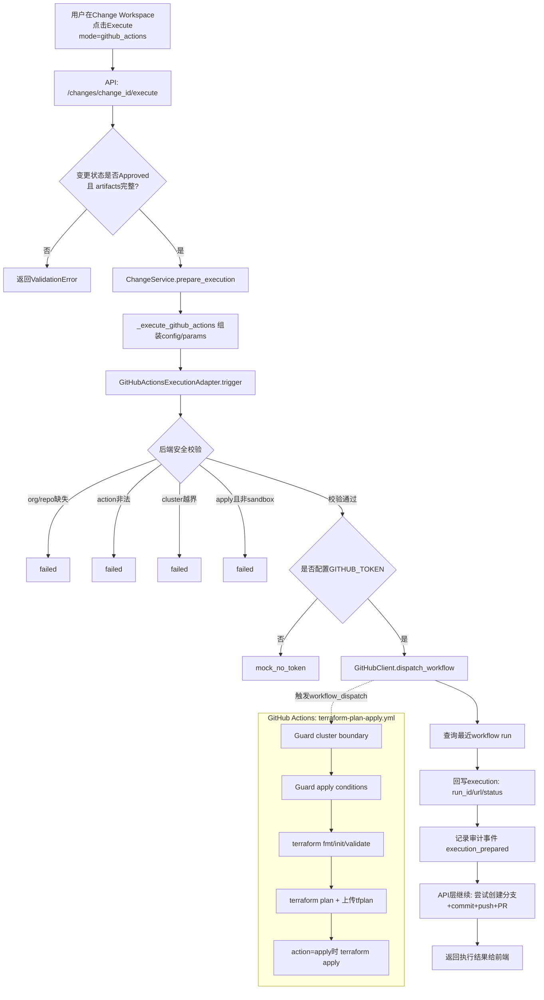

## Jun.08
Bug Fix:
1.Register Porject (https://github.com/Mayra-Zhao_3stripes/blueprint-demo)时报错: 
“Scan Errors
clone: git git clone --depth 1 https://github.com/Mayra-Zhao_3stripes/blueprint-demo.git blueprint-demo failed (exit 128): Cloning into 'blueprint-demo'... fatal: could not read Username for 'https://github.com': terminal prompts disabled
← Back
”
2.Resource Topology中的Project Tree: 其实是Env. 并且Resource Inventory不可以根据类型筛选另外, 如何链接到变更窗口. 
4.Infrastructure Resources中的Inventory,bu h 要根据K8S, AWS等大类进行区分. 
5. Module Management中包含重复类型.

Bug Fix2:
1.Register Porject (https://github.com/Mayra-Zhao_3stripes/blueprint-demo)时仍然报错: clone: git git clone --depth 1 https://github.com/Mayra-Zhao_3stripes/blueprint-demo.git blueprint-demo failed (exit 128): Cloning into 'blueprint-demo'... fatal: could not read Username for 'https://github.com': terminal prompts disabled
2.Resource Topology中只需包含AWS_*及K8S相关, terraform_output, 354 resources目前都不用包含进来.
3.Infrastrue Resource中的内容和Resource Topology有些重复,需要重新align下.
4.从Resource Topology中点Change之后,链接到Infrastrue Resource, 这部分我不太理解
5.修改配置文件后,点击Draft, 出现如下报错: 
{
  "detail": "unsupported Terraform object_id: ODP/resources/dev/ecp/control-tower"
}

## Jun.08-2
1.Resource Types 怎么拆的太细 可以做个分列,点进去才有详细信息
2.按照这个页面逻辑, Infrastructure Resources应该改为 Change Workspace. 我觉得Terraform Control Plant下的导航栏内容再思考下
3.后续我们对所有类型做一个规范, 虽然import terraform. 但是支持的Resouce等是逐步支持的, 提供一个目前支持的list
4.导航栏的序号去掉,并且调整下字体
5.Resource Discovery改为Discovery
6.Resource Management中的布局调整下: 移除Change History, 流程

Bug Fix:
修改ODP/resources/dev/ecp/o2-inventory时报错
{
  "detail": "service not found in infra/ODP/resources/dev/ecp.yaml: o2-inventory"
}

修改ODP/resources/dev/ana/keycloakx时报错
{
  "detail": "source YAML not found: infra/ODP/resources/dev/ana.yaml"
}
## Jun.09
K8S环境: 部署在本地的kind集群, 集群名称: kind-gitops-sandbox
GitProvider: Github Action 
1.学习Github Action, 通过Github Action实现CIC
2.D尝试接入真正的CICD工作流, 真正执行命令通过terraform plan & terraform apply实现K8S资源的变更
3.尝试通过平台将一个服务部署到K8S集群(kind-gitops-sandbox)

安全边界: 仅kind-gitops-sandbox集群可变更,不要操作任何这个集群以外的资源

Runbook: 见 `RUNBOOK_GITHUB_ACTIONS_KIND.md`

### Github Action CI/CD处理逻辑梳理

#### 1) 入口与前置条件
1. 变更执行入口: `POST /changes/{change_id}/execute` 且 `mode=github_actions`
2. 仅当变更状态为 `Approved` 时允许进入执行准备
3. 必须已生成并保留 artifacts: `validation`、`plan`、`approval`、`patched_yaml`

#### 2) 执行链路（后端）
1. API层读取项目配置并补全scope
  - org/repo（来自项目git_config）
  - workflow_id（默认 `terraform-plan-apply.yml`）
  - terraform_root（默认 `infra`）
  - cluster_name（默认 `kind-gitops-sandbox`）
2. ChangeService进入 `prepare_execution(..., mode=github_actions)`
3. `prepare_execution` 调用 `_execute_github_actions`
4. `_execute_github_actions` 组装 dispatch 参数
  - branch: `cr-{change_id}`
  - environment: 变更env（默认sandbox）
  - action: `apply`
  - change_id
  - cluster_name
5. `GitHubActionsExecutionAdapter.trigger()` 执行安全校验
  - 必须提供 org/repo
  - action 仅允许 `plan|apply`
  - cluster_name 必须等于 `kind-gitops-sandbox`
  - 若 action=apply，则 environment 必须是 sandbox
6. 通过 `GitHubClient.dispatch_workflow()` 触发 `workflow_dispatch`
7. 查询最近 workflow run 并回填 run_id / html_url
8. 回写 change.artifacts.execution 与审计事件

#### 3) Workflow内实际Terraform执行
GitHub Actions工作流 `terraform-plan-apply.yml` 中固定执行:
1. Guard cluster boundary（仅允许 `kind-gitops-sandbox`）
2. Guard apply conditions（apply仅允许sandbox + 指定cluster）
3. terraform fmt -check
4. terraform init
5. terraform validate
6. terraform plan 并上传 tfplan artifact
7. action=apply 时执行 terraform apply

#### 4) 安全边界（双重防护）
1. 平台后端校验: adapter层阻断非 `kind-gitops-sandbox` / 非sandbox apply
2. GitHub Actions校验: workflow步骤再次阻断越界cluster或非法apply环境

#### 5) 当前实现注意点
1. 当前 `prepare_execution` 会先触发 workflow dispatch，再在API层尝试创建分支/提交/PR
2. 若workflow依赖 `cr-{change_id}` 分支内容，建议将“推分支+提交”前置到dispatch之前

